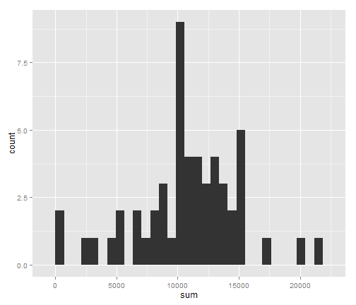
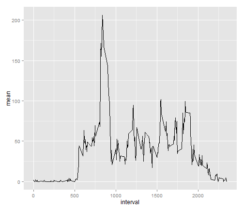
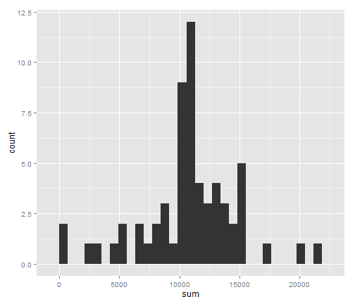
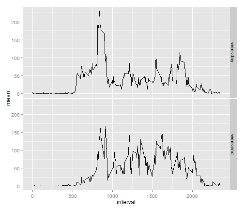

PA1_Template
========================================================

#Loading and preprocessing the data

1. Loading the data and libraries:


```r
setwd("C:\\Users\\Antoine\\Google Drive\\R\\Repro")
data<-read.csv("activity.csv")
library("plyr")
```

```
## Warning: package 'plyr' was built under R version 3.0.3
```

```r
library("ggplot2")
```

```
## Warning: package 'ggplot2' was built under R version 3.0.3
```


#What is mean total number of steps taken per day?

1. Make a histogram of the total number of steps taken each day:


```r
Dsteps<-ddply(data,.(date),summarize,sum=sum(steps))
qplot(sum, data=Dsteps)
```

```
## stat_bin: binwidth defaulted to range/30. Use 'binwidth = x' to adjust this.
```

 

2. Calculate and report the mean and median total number of steps taken per day


```r
mean1<-mean(Dsteps$sum,na.rm=T)
median1<-median(Dsteps$sum,na.rm=T)
```

So the mean is **1.0766189 &times; 10<sup>4</sup>** and the median is **10765**


#What is the average daily activity pattern?

1. Make a time series plot (i.e. type = "l") of the 5-minute interval (x-axis) and the average number of steps taken, averaged across all days (y-axis)


```r
Isteps<-ddply(data,.(interval),summarize,mean=mean(steps,na.rm=T))
qplot(interval,mean,geom="line",data=Isteps)
```

 

2. Which 5-minute interval, on average across all the days in the dataset, contains the maximum number of steps?


```r
max<-Isteps$interval[Isteps$mean==max(Isteps$mean,na.rm=T)]
```

The 5-minute interval, on average across all the days in the dataset, contains the maximum number of steps **835**.


#Imputing missing values

1. Calculate and report the total number of missing values in the dataset (i.e. the total number of rows with NAs)


```r
SumNA<-sum(apply(data,1,is.na))
```

The total number of missing values in the dataset is **2304**

2. Devise a strategy for filling in all of the missing values in the dataset. The strategy does not need to be sophisticated. For example, you could use the mean/median for that day, or the mean for that 5-minute interval, etc.

The strategy consists in replacing NAs by the mean for that 5-minute interval.

3. Create a new dataset that is equal to the original dataset but with the missing data filled in.


```r
data2<-data
for (i in 1:length(data2$steps)) { 
  if (is.na(data2$steps[i])) {
    data2$steps[i]<-Isteps[data2$interval[i]==Isteps$interval,]$mean
    }
  }
```

4. Make a histogram of the total number of steps taken each day and Calculate and report the mean and median total number of steps taken per day. Do these values differ from the estimates from the first part of the assignment? What is the impact of imputing missing data on the estimates of the total daily number of steps?


```r
Dsteps2<-ddply(data2,.(date),summarize,sum=sum(steps))
mean2<-mean(Dsteps2$sum)
median2<-median(Dsteps2$sum)
qplot(sum, data=Dsteps2)
```

```
## stat_bin: binwidth defaulted to range/30. Use 'binwidth = x' to adjust this.
```

 

So the mean is **1.0766189 &times; 10<sup>4</sup>** and the median is **1.0766189 &times; 10<sup>4</sup>**. Te median is now equal to the mean which is possible given the fact that the number of steps can be estimated based on this mean.


#Are there differences in activity patterns between weekdays and weekends?


1. Creation a new factor variable in the dataset with two levels -- "weekday" and "weekend" indicating whether a given date is a weekday or weekend day


```r
data2$week<-ifelse(weekdays(as.Date(data2$date)) %in% c("samedi","dimanche"), "weekend","weekday")
data2$week<-as.factor(data2$week)
```


2. Make a panel plot containing a time series plot of the 5-minute interval and the average number of steps taken, averaged across all weekday days or weekend days.


```r
Isteps2<-ddply(data2,.(interval,week),summarize,mean=mean(steps))
qplot(interval,mean,facets=week~.,data=Isteps2,geom="line")
```

 

==================================================================================================
